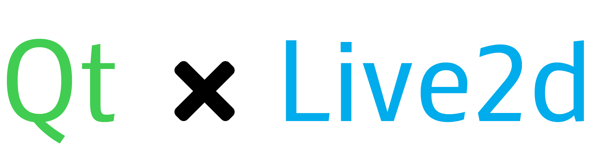

<p align="center">
  
</p>
<p align="center">
  A Qt-based Live2d widget
</p>
<p align="center">
  <a href="https://github.com/duanxianpi/QtLive2d/blob/main/LICENSE.md">  
    
  </a>
  <a href="https://github.com/duanxianpi/QtLive2d">
    
  </a>
  <a href="https://github.com/duanxianpi/QtLive2d/releases">
    
  </a>
  <a href="https://github.com/duanxianpi">
    
  </a>
</p>

## Introduction
QtLive2d is a Qt-based Live2d widget, it is modified from the [official Live2d Sample](https://github.com/Live2D/CubismNativeSamples). Unlike the official examples, QtLive2d uses QOpenGLWidget and QOpenGLFunctions provided by Qt instead of glfw and glew. This makes it easy to combine with any Qt Gui software.

**Thanks [@6ziv](https://github.com/6ziv) for your blogs and projects. They have helped me a lot on this project**
## Feature
* Easy to use
* Using OpenGL instead of WebGL
* Less resource consumption
* Support Live2d mouse events
* Support transparent background
* CrossPlatform

## Sample
We provide a sample application called Sample to show you how to use it.

Running on Win10:

[](https://imgtu.com/i/HUSmi4)

Running on Ubuntu (xcfe4):

[](https://imgse.com/i/ppe7Pkn)
## Build Instructions
### Project Structure
```
│   QtLive2d.pro
│
└───src
    ├───Core
    │
    ├───dll
    │       libLive2DCubismCore.so
    │
    ├───Framework
    │       Framework.pro
    │
    ├───lib
    │
    └───Sample
        │   Sample.pro
        │
        ├───QtLive2dWidget
        │
        └───Resources
```
Here is the basic structure for QtLive2d. To build the Sample, we just need to build the main project `QtLive2d.pro`. It help us automatically finish the compile processing. 
1. Compile Framework 
2. Copy `Framework.lib` to the lib file. 
3. Compile Sample.

Folder `Core` are from CubismNativeSamples. All the library is pre-compiled.

## Usage in your program
### Dependency
* Live2DCubismCore.lib
* Framework.lib
* OpenGL32 (Only for Win32)
* User32 (Only for Win32)
* Glu32 (Only for Win32)

### Steps to merge QtLive2d into your program 
1. For Win32 **Please use MSVC 2017 or 2019! and std C++ 17**
1. To use QtLive2d in your program, you need to add Floder QtLive2d, Framework, thirdParty and Core into you project.
2. Add includepath and dependpath in `pro` file
    ```pro
    INCLUDEPATH += $$PWD/Core/include
    INCLUDEPATH += $$PWD/Framework/src
    INCLUDEPATH += $$PWD/thirdParty/stb
    ```
5. Add Framework.lib into `pro` file. 
   ```pro
    CONFIG += debug_and_release
    CONFIG(debug, debug|release){
      message(Debug build)
      LIBS += -L$$PWD/lib/ -lFrameworkd

    }

    CONFIG(release, debug|release){
      message(Release build)
      LIBS += -L$$PWD/lib/ -lFramework

    }
   ```
6. Add Live2DCubismCore lib into `pro` file. 
   ```pro
    CONFIG += debug_and_release
    CONFIG(debug, debug|release){
      message(Debug build)
      LIBS += -L$$PWD/lib/ -lLive2DCubismCore_MDd

    }

    CONFIG(release, debug|release){
      message(Release build)
      LIBS += -L$$PWD/lib/ -lLive2DCubismCore_MD

    }
   ```

7. For Win32, Please the following as well
    ```pro
      LIBS += -lOpenGL32
      LIBS += -lUser32
      LIBS += -lGlu32
    ```
  
8. QLive2dWidget is a subclass of QOpenGLWidget, which can be used directly or be promoted in the Qt Designer.
9. To use QOpenGLWidget in **Qt 6**, you need add extra moudules openglwidgets
    ```pro
    QT       += core gui opengl widgets
    greaterThan(QT_MAJOR_VERSION, 5) {QT += openglwidgets}
    ```
11. Define you model path in `LAppDefine.cpp`.
12. Enjoy it!

## What's Next?
- [x] Cross Platform

## License
Copyright (C) 2022 duanxianpi

Permission is hereby granted, free of charge, to any person obtaining a copy of this software and associated documentation files (the "Software"), to deal in the Software without restriction, including without limitation the rights to use, copy, modify, merge, publish, distribute, sublicense, and/or sell copies of the Software, and to permit persons to whom the Software is furnished to do so, subject to the following conditions:

The above copyright notice and this permission notice shall be included in all copies or substantial portions of the Software.

THE SOFTWARE IS PROVIDED "AS IS", WITHOUT WARRANTY OF ANY KIND, EXPRESS OR IMPLIED, INCLUDING BUT NOT LIMITED TO THE WARRANTIES OF MERCHANTABILITY, FITNESS FOR A PARTICULAR PURPOSE AND NONINFRINGEMENT. IN NO EVENT SHALL THE AUTHORS OR COPYRIGHT HOLDERS BE LIABLE FOR ANY CLAIM, DAMAGES OR OTHER LIABILITY, WHETHER IN AN ACTION OF CONTRACT, TORT OR OTHERWISE, ARISING FROM, OUT OF OR IN CONNECTION WITH THE SOFTWARE OR THE USE OR OTHER DEALINGS IN THE SOFTWARE.
